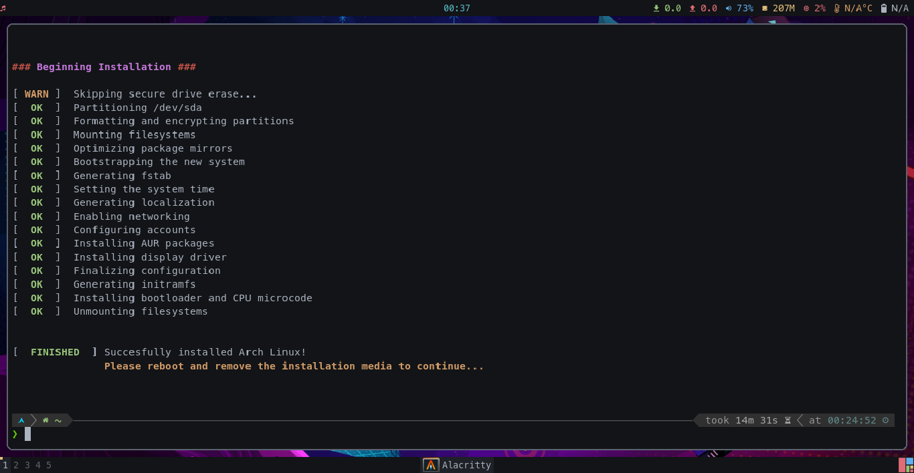

# Arch-GRIT

[](https://github.com/ralgar/arch-grit/tags)
[](https://github.com/ralgar/arch-grit/actions)
[](https://www.gnu.org/licenses/gpl-2.0.html)
[](https://github.com/ralgar/arch-grit)

## Overview
Arch Graphical Recovery and Installation Tool (Arch-GRIT) - a live, graphical
 Arch Linux ISO, with my custom installer written in Bash.

This is a project with only one goal - easy redeployment of my opinionated,
 minimal Arch Linux system configuration, which is primarily designed for the
 needs of power users such as sysadmins and developers.



### Features

- [x] **Live system / ISO**
  - [x] Full graphical environment
  - [x] High compatibility
  - [x] Wide variety of useful tools
  - [x] Automatic rebuilds on the first day of the month
- [x] **TUI installer**
  - [x] Takes user input
  - [x] Handles a variety of hardware configurations
  - [x] Delivers a fully functional system
- [x] **Installed system**
  - [x] Uses ZFS for data security and integrity
    - [x] Native encryption enabled by default (at the zpool level)
    - [x] LZ4 compression enabled by default (at the zpool level)
    - [x] Pairs `linux-lts` with `zfs-dkms` for maximum reliability
    - [x] Automatic snapshots before all `pacman` transactions
    - [x] Automatic, weekly scrubs
    - [x] Automatic TRIM/discard on supported devices
    - [x] Uses `atime=off` for best performance
  - [x] Uses smartd for disk health monitoring
  - [x] Firewalld enabled by default

## Getting Started

There are two ways to use this project:
1. Download the [latest pre-built ISO](https://github.com/ralgar/arch-grit/releases)
   and write it to a USB drive, following the instructions in [Usage](#usage)
1. Build it from source with the [instructions below](#building), before
   continuing on to [Usage](#usage)

### Building

#### Prerequisites

To build the ISO, you will need an existing Arch Linux system with the
 `archiso` package installed. A containerized build system is also being
 developed for a future release.

1. Clone the repo:
   ```sh
   git clone https://github.com/ralgar/arch-grit.git
   ```
2. Navigate into the repo:
   ```sh
   cd arch-grit
   ```
3. Start the build using the included `Makefile`.
   ```sh
   sudo make
   ```

## Usage

### Booting the live system

1. To write the ISO to a USB drive, follow the instructions provided by the
   [Arch Linux Project](https://wiki.archlinux.org/title/USB_flash_installation_medium).
2. Boot from the live USB. The bootloader will present you with two options.
   If your system has sufficient RAM (at least 4GB), then I recommend choosing
   the `Copy to RAM` option. Otherwise, choose the default option.
3. When the live system has finished booting, it will automatically log in and
   launch a terminal window. The live environment is very similar to the final
   product, so this is a good opportunity to test it out before committing to
   a permanent installation.

### Navigating the live system

There are a few keyboard shortcuts that are important to know:

| Key Combo         | Description                          |
|-------------------|--------------------------------------|
| Super + 1-9       | Switch workspaces.                   |
| Super + Enter     | Opens a new terminal window.         |
| Super + E         | Opens the app launcher.              |
| Super + Q         | Closes the currently focused window. |
| Super + Shift + Q | Ends the current session (logout).   |

**Note:** The default user is unprivileged. You can gain root privileges by
 using `sudo` with the password `archlinux`.

### Using the arch-grit command

The `arch-grit` command is simple to use:

| Invocation          | Description                                      |
|---------------------|--------------------------------------------------|
| `arch-grit install` | Starts the interactive installer.                |
| `arch-grit mount`   | Mounts an existing system for recovery purposes. |
| `arch-grit umount`  | Umounts a previously mounted system.             |

## License

Distributed under the GNU GPLv2 License. See `LICENSE` for more info.

## Acknowledgements

Some of the following software is showcased in this project:
* [AwesomeWM](https://github.com/awesomeWM/awesome)
* [Powerlevel10k](https://github.com/romkatv/powerlevel10k)
